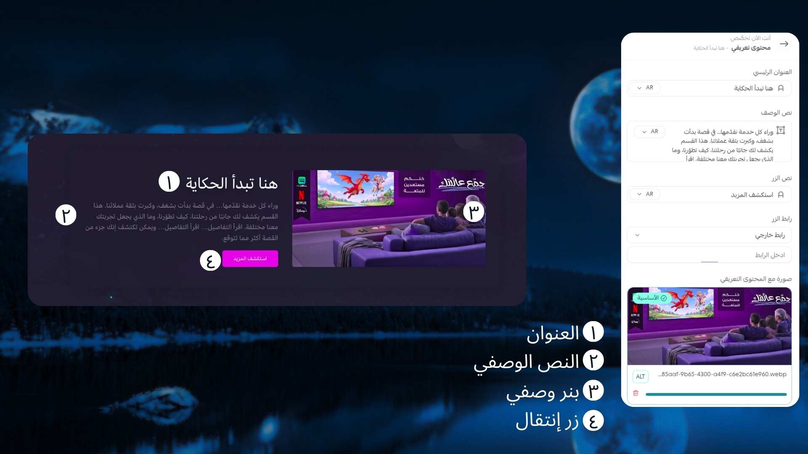

# محتوى تعريفي

## كيفية الاستخدام

خطوات إنشاء محتوى تعريفي في قالب Moon

لإنشاء قسم محتوى تعريفي داخل قالب Moon بطريقة صحيحة واحترافية، اتبع الخطوات التالية:

1️⃣ إضافة العنوان الرئيسي للمكوّن

قم بكتابة عنوان واضح وجذاب يعبّر عن فكرة القسم ويشد انتباه الزائر من اللحظة الأولى.

2️⃣ إضافة فقرة وصفية

أضف فقرة قصيرة توضّح الهدف من هذا القسم وتشرح الفائدة أو القيمة التي سيحصل عليها الزائر بشكل مباشر ومفهوم.

3️⃣ تحديد رابط الزر

قم بإدخال رابط الزر (Button Link) بحيث يوجّه المستخدم إلى الصفحة المطلوبة، سواء كانت صفحة منتج، اشتراك، أو صفحة تواصل.

4️⃣ إضافة صورة وصفية

اختر صورة تعبّر عن المحتوى المعروض وتعزّز الرسالة البصرية للقسم، مما يساعد في إيصال الفكرة بشكل أسرع وأكثر تأثيرًا.

باتباع هذه الخطوات، يمكنك إنشاء قسم محتوى تعريفي متكامل يعكس هوية متجرك ويمنح الزائر تجربة واضحة واحترافية داخل