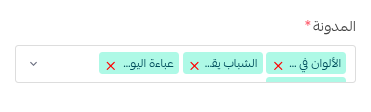

# قسم المونة

# مقدمة

قسم المدونة ضروري للغاية في جميع المتاجر عبر الإنترنت، حيث يمكنك سرد قصة لعملائك وإشراك مجتمع كامل في متجرك، وهذا القسم لن يخلق عملاء فحسب، بل معجبين أيضًا سيتابعون أحدث صيحات متجرك ويشاركون منتجاتك في مجتمع الموضة.

## توضيح

ينقسم هذا القسم إلى قسمين رئيسيين، القسم الأول، محاذي عموديا ويحتوي على العنوان والعنوان الفرعي، والقسم الثاني يتكون من مجموعة المدونات التي تريد عرضها في صفحتك الرئيسية

## كيفية الاستخدام

لكي تتمكن من إنشاء قسم مدونتك وتخصيصه، نحتاج أولاً إلى البدء بإدخال عنوان لطيف وجذاب ثم العنوان الفرعي وهو عبارة عن جملة لطيفة تصف قسم المدونة

أخيرًا والأهم من ذلك، اختر المدونات التي ترغب في عرضها في صفحتك الرئيسية. عندما ينقر العميل على صورة المدونة، سيذهب إلى محتوى المدونة لقراءة المقال.

