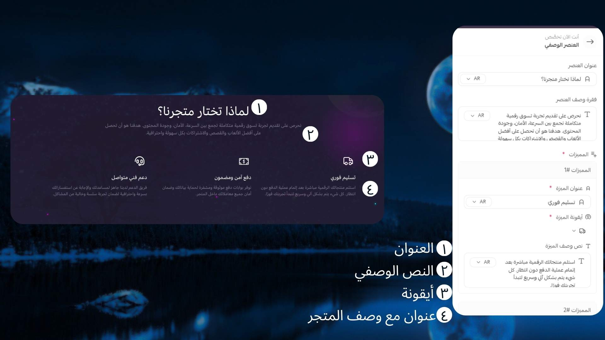

# العنصر الوصفي

## كيفية الاستخدام

**كيفية إنشاء العنصر الوصفي في قالب Moon**

لإنشاء قسم *العنصر الوصفي* داخل قالب **Moon** بطريقة احترافية تعكس هوية متجرك، اتبع الخطوات التالية:

### 1️⃣ اختيار عنوان للمكوّن

قم بتحديد عنوان واضح ومعبر يوضّح فكرة القسم ويعكس رؤية متجرك بشكل مباشر.

### 2️⃣ إضافة فقرة محتوى

أضف فقرة وصفية تساعد في تقديم فكرة عامة عن متجرك، رسالته، والقيمة التي يقدمها للعملاء.

### 3️⃣ اختيار مميزات أو خصائص المتجر

حدد أبرز المميزات أو الخصائص التي تميز متجرك وتعبر عن رؤيتك وهويتك التجارية.

### 4️⃣ إعداد عناصر كل ميزة

لكل ميزة، قم بتحديد:

* أيقونة مناسبة تعبّر عن الفكرة بصريًا
* عنوان مختصر وواضح
* فقرة وصفية قصيرة تشرح هذه الميزة وتبرز قيمة علامتك التجارية

من خلال اتباع هذه الخطوات، يمكنك إنشاء عنصر وصفي متكامل يعزز هوية متجرك ويبرز نقاط قوته داخل قالب Moon بطريقة منظمة وجذابة.
