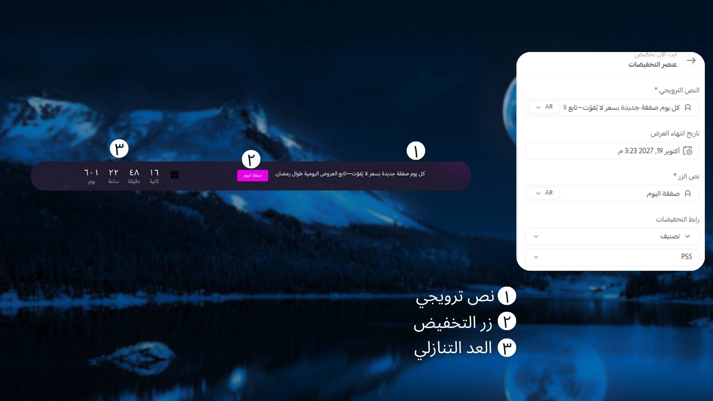

# عنصر التخفيضات

## كيفية الاستخدام
**كيفية إنشاء عنصر التخفيضات في قالب Moon**

لإعداد قسم *عنصر التخفيضات* داخل قالب **Moon** بطريقة فعّالة وجذابة، اتبع الخطوات التالية:

### 1️⃣ اختيار عنوان ترويجي جذاب

قم بكتابة عنوان ملفت يعكس قوة العرض أو الحدث الترويجي، ويحفّز الزائر على التفاعل والاستفادة من الخصم.

### 2️⃣ تحديد تاريخ انتهاء العرض

اختر تاريخ انتهاء الخصم أو الفعالية داخل المتجر، وذلك لخلق إحساس بالعجلة وتشجيع العملاء على اتخاذ قرار الشراء قبل انتهاء العرض.

### 3️⃣ إضافة نص للزر

اكتب عبارة واضحة ومباشرة على الزر مثل “تسوق الآن” أو “استفد من العرض” لتحفيز المستخدم على النقر.

### 4️⃣ تحديد رابط العرض

قم بإضافة الرابط المرتبط بالعرض، سواء كان صفحة منتج، تصنيف معين، أو صفحة الفعالية الترويجية داخل متجرك.

باتباع هذه الخطوات، يمكنك إنشاء عنصر تخفيضات متكامل يعزز الحملات الترويجية ويزيد من معدل التفاعل والمبيعات داخل قالب Moon.
