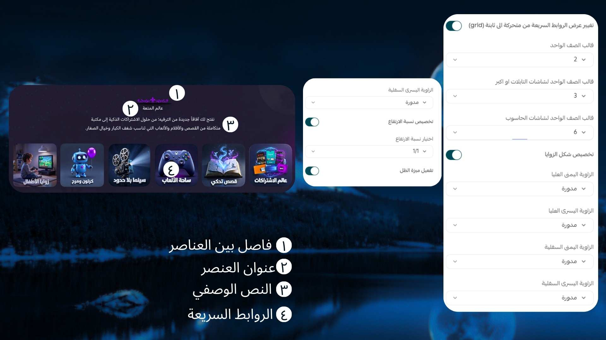

# صانع الروابط السريعة

## كيفية الاستخدام

**كيفية إنشاء قسم الروابط (Links Section) في قالب Moon**

لإعداد قسم روابط مخصص داخل قالب **Moon** يعزز تجربة التصفح ويوجه الزوار إلى الصفحات المهمة، اتبع الخطوات التالية:

---

### 1️⃣ إضافة العنوان والفقرة الوصفية

ابدأ بإضافة عنوان رئيسي واضح للقسم، ثم أضف فقرة وصفية قصيرة تشرح الهدف من هذه الروابط، مثل توجيه العملاء إلى أقسام مهمة أو عروض خاصة.

---

### 2️⃣ تحديد موضع المكوّن

اختر موضع عرض القسم بما يتناسب مع لغة المتجر واتجاهه:

* في المنتصف (Center)
* بمحاذاة اليمين أو اليسار (Justified Right/Left)

يساعد ذلك في الحفاظ على تناسق التصميم مع اتجاه الصفحة (RTL أو LTR).

---

### 3️⃣ تفعيل أو تعطيل القسم الفاصل

يمكنك إضافة عنصر فاصل لتعزيز الهوية البصرية للقسم:

* عند التمركز في المنتصف، يمكن استخدام صورة تعبيرية مميزة.
* عند المحاذاة يمينًا أو يسارًا، يمكن إضافة أيقونة بسيطة مكملة بجانب العنوان.

هذا الخيار يمنح التصميم طابعًا فريدًا وعمقًا بصريًا.
كما يمكنك تعطيل هذه الميزة بالكامل إذا رغبت، كما هو موضح في الصورة المرجعية.

---

### 4️⃣ إضافة الروابط

ابدأ بإضافة الروابط الخاصة بك وفق الترتيب التالي:

* عنوان اختياري للرابط
* عنوان فرعي (إن وجد)
* صورة تمثل الرابط
* تحديد الرابط الذي سيتم توجيه المستخدم إليه عند النقر

---

### 5️⃣ تخصيص شكل الروابط

يمكنك التحكم الكامل في مظهر كل رابط من خلال:

* **نسبة الأبعاد (Aspect Ratio):**
  اختيار الشكل مربع (Square) أو مستطيل (Rectangle).

* **تخصيص الزوايا:**
  يمكنك جعل الزوايا دائرية أو حادة، والتحكم بها لكل رابط بشكل مستقل.

* **تأثير الظل (Shadow):**
  تفعيل أو تعطيل تأثير الظل لكل عنصر حسب الرغبة.

* **طريقة العرض (Layout):**
  اختيار عرض الروابط بنمط:

  * سلايدر (Slider)
  * شبكة (Grid)

---

من خلال هذه الخيارات، يمكنك إنشاء قسم روابط احترافي ومرن يعكس هوية متجرك ويمنح تجربة استخدام مميزة داخل قالب Moon.
