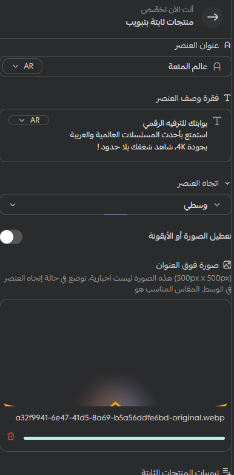
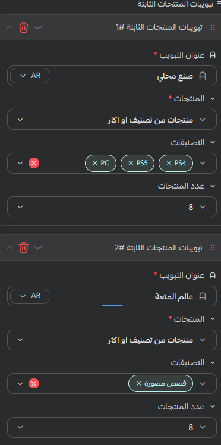

# منتجات ثابتة بتبويبات

## كيفية الاستخدام

**كيفية إنشاء قسم المنتجات الثابتة بتبويبات في قالب Moon**

لإعداد قسم يعرض المنتجات ضمن تبويبات منظمة، اتبع الخطوات التالية:

---

### 1️⃣ إضافة العنوان

ابدأ بكتابة عنوان واضح للقسم، ليظهر أعلى مكوّن المنتجات الثابتة.

---

### 2️⃣ إضافة الوصف

أضف وصفًا مختصرًا يوضح محتوى القسم أو يساعد الزائر على فهم المنتجات المعروضة.

---

### 3️⃣ اختيار المحاذاة

اختر محاذاة محتوى المكوّن بما يناسب تصميم صفحتك:

* في المنتصف (Center)
* بمحاذاة مضبوطة (Justified)

---

### 4️⃣ اختيار الفاصل

اختر العنصر الذي ترغب في استخدامه كفاصل، ويعتمد ذلك على محاذاة المكوّن:

* أضف أيقونة إذا اخترت المحاذاة المضبوطة.
* أضف صورة إذا اخترت المحاذاة في المنتصف.

---

### 5️⃣ إنشاء التبويبات

ابدأ بإنشاء التبويبات التي ستقسّم المنتجات إلى مجموعات يسهل تصفحها.

---

### 6️⃣ إعداد التبويبات

داخل كل تبويب، أدخل عنوان التبويب، ثم حدّد المشاريع ومصادرها، واختر عدد المنتجات التي ستظهر فيه.

---

### 7️⃣ إضافة التبويبات وحفظ الإعدادات

أضف العدد الذي تحتاج إليه من التبويبات، ثم اضغط على زر الحفظ لتطبيق الإعدادات.

بعد الحفظ، سيظهر المكوّن بالنتيجة النهائية الموضحة في الصورة أعلى الصفحة.
