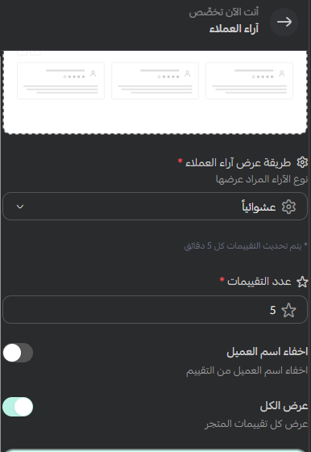

# آراء العملاء

## كيفية الاستخدام

### إعداد طريقة عرض آراء العملاء

من إعدادات قسم **آراء العملاء** في القالب، يمكنك تخصيص التقييمات التي تظهر في المتجر:

1. **طريقة عرض الآراء:** اختر ترتيب التقييمات التي تريد عرضها:
   - **عشوائياً:** يعرض التقييمات بترتيب متغيّر.
   - **الأحدث:** يعرض التقييمات الأحدث أولاً.
   - **الأعلى تقييماً:** يعرض التقييمات ذات التقييم الأعلى أولاً.
2. **عدد التقييمات:** حدّد عدد التقييمات التي تريد إظهارها.
3. **إخفاء اسم العميل:** فعّل هذا الخيار لإخفاء أسماء العملاء من التقييمات.
4. **عرض الكل:** فعّل هذا الخيار لعرض جميع تقييمات المتجر بدلاً من الاقتصار على العدد المحدد. عطّله لعرض العدد الذي اخترته في إعداد **عدد التقييمات**.

بعد ضبط الخيارات، احفظ التغييرات لمعاينة قسم آراء العملاء في متجرك.
